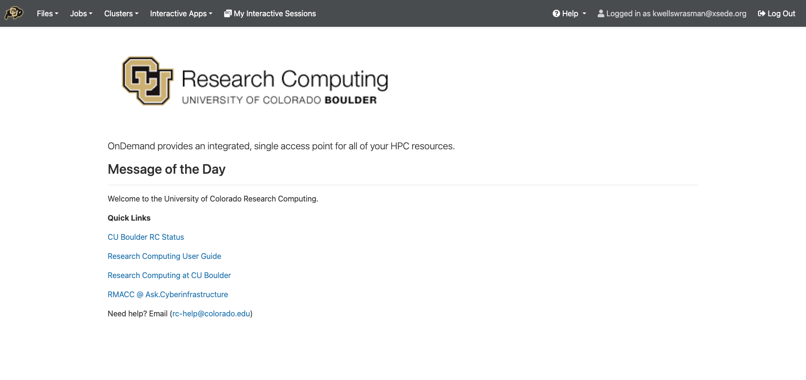
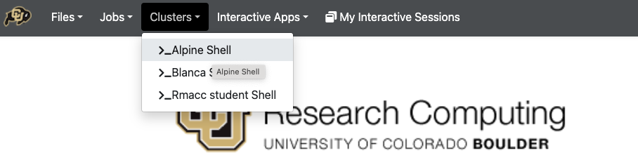
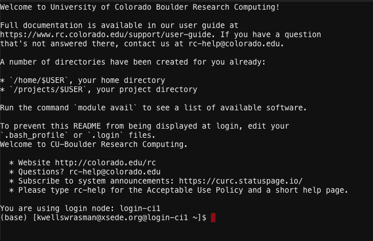
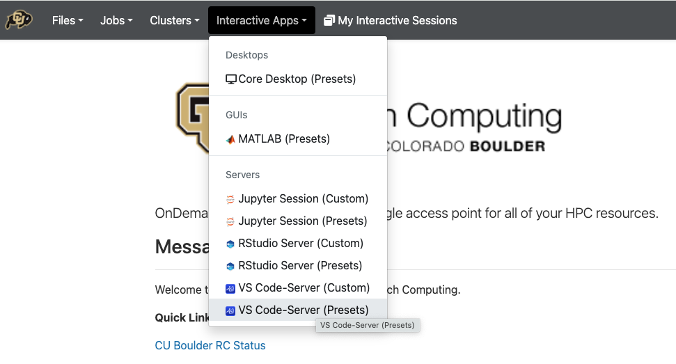
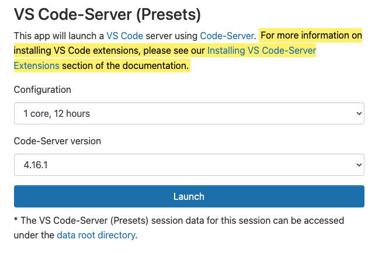
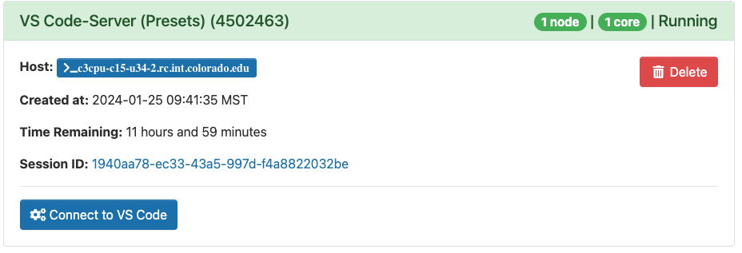
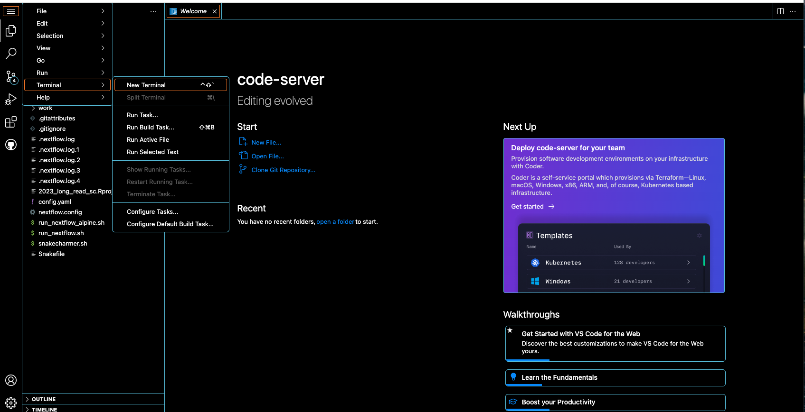
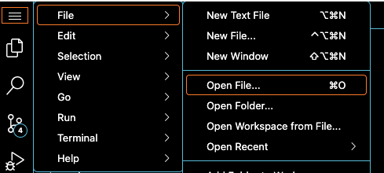
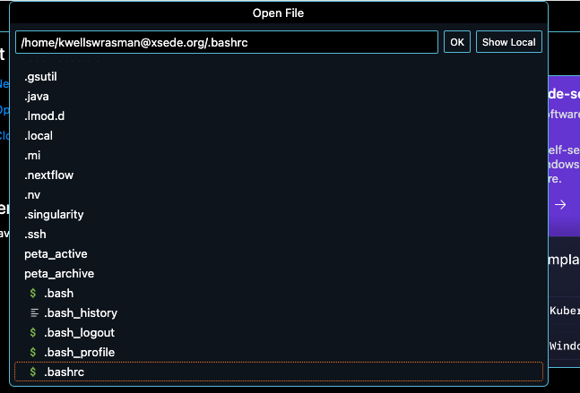

# Alpine Guide

This repository is meant as a guide for using the alpine server at the University of Colorado Anschutz. This is meant to be a comprehensive resource on how to use the server, any contributions are welcome!

## Getting help
If you don't find the answer to your question in this repository, Alpine has incredible documentation. We will refer to this documentation throughout this repository. You can access the alpine documentation [here](https://curc.readthedocs.io/en/latest/index.html).

## About Alpine
Alpine is a **Free** server to all members of the Anschutz campus. Running jobs is entirely free and you can use scratch storage for the majority of your work. Each user has 10TB of storage in scratch, but all files on scratch will be automatically deleted 90 days after the date they were copied or created. If you want any permanent storage, that can be purchased on the [peta library](https://www.colorado.edu/rc/resources/petalibrary/storageandrates).

Alpine uses a slurm scheduler to submit jobs and manage user resources. In this repository, we will provide details about how to interact with a slurm scheduler.

## Creating an account
All members of Anschutz must create an account following the tutorial [here](https://curc.readthedocs.io/en/latest/access/rmacc.html). This includes for creating an [ACCESS-CI](https://access-ci.org/) account.


## Logging in

To log into alpine, follow [this link](https://ondemand-rmacc.rc.colorado.edu) make sure you select "ACCESS CI (XSESE)" as your identity provider. Then enter your credentials.

This will take you to the welcome page for Alpine.



There are a few things to notice

1. The quick links will be incredibly useful to you.
  * A link to the status of the alpine cluster. This will include information about any problems or outages.
  * A link to the user guide for alpine. This is an amazing resource for you to use if you ever have a question or need help. I will link to this resource throughout this guide.
  * A link to a helpful Q&A site
  * The email that you can use if you have any questions
2. A link at the top to access and download any files that you have stored on Alpine or the Petalibrary
3. A link to view your active jobs
4. A link to start running a new terminal session
5. A link to use interactive apps that are already installed. These include vscode, jupyter notebooks, and rstudio sessions


We will walk through most of these today.

### Starting a terminal window

To start with a terminal window, first click `Clusters` at the top of the page and select `>_Alpine Shell` from the drop down menu.



This will open a new window with a terminal



This terminal will give you access to all of your files and will allow you to run any type of compute job that you want.

**NOTE this page automatically logs into the head or login node, you will need to start an interactive job before doing any sort of computationally intensive tasks such as installing packages, running scripts, or copying files**

Most clusters have a head or login node. This is a gateway for all users to access the cluster. The primary functions of the login node are user authentication, job submission, and managing access to the compute nodes. Users log into this node to submit and monitor their computational tasks.

However, the head node is not designed for computationally intensive tasks. Its resources are limited and intended for administrative purposes and user interaction. Running resource-intensive computations on the head node can degrade its performance and impact the overall cluster efficiency.

Instead, you need to submit your computationally intensive jobs to compute nodes designated for such tasks. These nodes typically have higher processing power and memory capacity, ensuring efficient execution of parallelized and demanding calculations.

But don't worry, you can work interactively on the compute nodes to install packages and test pipelines, you just will need to start an interactive job first.

### Starting an interactive session

When starting an interactive job, you will request and acquire the necessary computing resources to perform your task. You, and you alone, will have access to these compute resources for as long as you requested.

Starting an interactive job is relatively easy. You just need to run the following command in the terminal.

```bash
sinteractive --partition=amilan --time=04:00:00 --ntasks=1 --mem=10000
```


Here is a breakdown of the command

* `sinteractive` - submit a job that is interactive, this will grant direct access to resources.
* `--partition=amilan` - This is the partition to submit to. `amilan` will almost always be the correct choice for partitions, but you can see other options [here](https://curc.readthedocs.io/en/latest/running-jobs/job-resources.html#partitions).
* `--time=04:00:00` - How long do you want to have access to these resources? This example shows 4 hours. Pick a number that you think is reasonable, for example, I doubt you will be working 24 hours each day, so setting `--time=24:00:00` is unnecessary and wastes resources.
* `--ntasks=1` - How many nodes do you want to use? Generally for interactive sessions, 1 is enough.
* `--mem=10000` - How much memory do you need? This example shows 10GB. Again, try to pick a number that is enough for your needs, but not excessive. 4000 or 10000 tend to be good options for interactive sessions.

For more information on interactive jobs, see the [help pages](https://curc.readthedocs.io/en/latest/running-jobs/interactive-jobs.html)

**I sugesst running the above command every time you log onto the server using the approach described above**

### Making aliases
The command to initiate an interactive session on the cluster can be lengthy and challenging to remember. Luckily, there's a more convenient solution – you can streamline the process by adding an alias to your `bashrc` file.

*What is a bashrc?*

The `bashrc` is a crucial file executed each time you start a new session on the cluster. Whether logging into the head node or submitting a job, this file plays a key role in configuring your environment. It allows you to pre-load packages, define shortcuts, and manage the visibility of items in your path.

We will be working with the `bashrc` file thorughout this tutorial. Let's start by opening the file using the editor `vim`

```bash
vim ~/.bashrc
```

Note, the above command can be executed from any location within alpine (ie from any directory), this is because the file is always located in your home directory and the `~` is a shortcut for the home directory.

Additionally, the `bashrc` is a hidden file. This means that if you look at your home directory in a directory or use `ls` to view the contents of the directory, you won't see it. All hidden files start with a `.`. You might have noticed these files when you copy contents of a directory to one drive (for example `.DS_Store` shows up frequently).


Once you open the file, you will likely see there is already some text there. To get into editing mode, type `i`.

Then navigate under

```
# User specific aliases and functions
```

and add

```
# Alias
alias interactive="sinteractive --partition=amilan --time=04:00:00 --ntasks=1 --mem=10000"
```

Here you are saying that you want an alias named `interactive`. This means that typing `interactive` in the future will be interpreted as the full command.

Remember, you can update this command to be the amount of time and memory that you would want most often.

Now exit out of `vim` and save your work

`Esc` + `:wq` + `Enter`


To apply your changes immediately, run:

```bash
source ~/.bashrc
```

This is only necessary right now as from now on, any time you start a new session, this file will be sourced automatically.

To test that it worked type

```bash
interactive
```

### Logging on with vs code

An alternative to logging in through a terminal is to use `VS Code`. VS code stands for Visual Studio Code and is an editor with many features.

To log in with vs code, go back to the [main dashboard](https://ondemand-rmacc.rc.colorado.edu/pun/sys/dashboard) in your favorite web browser and select `Interactive Apps` and choose `VS Code-Server (Presets)` from the drop down menu.



Once you reach the VS Code page, select the number of cores and the length of time that you want and select launch



After hitting `launch`, you may need to wait a few seconds to a few minutes for your job to start. When your job is ready, `Connect to VS Code` will appear. Clicking this will take you into your VS Code session.



Once you connect, a blank page will open. You can start a terminal directly within VS Code by clicking the lines in the top left, and selecting `terminal` --> `new_terminal`




**Note starting a terminal in this way will open a terminal already on a compute node, you don't need to start an interactive session.**

You can tell what node you are on by looking at the brackets before your cursor. If you see

```
kwellswrasman@xsede.org@login-ci1
```

You are on a login node - notice the `login-ci1` after the @ symbol.

If you see

```
kwellswrasman@xsede.org@c3cpu-c15-u34-2
```

You are on a compute node. The node you are on won't always be the same but if you see `cpu` or `gpu`, you know that you are on a compute node rather than a login node.

Another huge benefit of VS Code is that you can edit files in an interactive editor and save the file directly to the server without using `vim`. 

Let's try this with the alias and open our `~.bashrc`

First open a file with `File` --> `Open File`




Then type

`~/.bashrc` into the box that shows up at the top. You can type any full path into this box to see what youare doing. Once you have put in the path, click the file, and click open if a box appears



You can now edit this file as you would in any editior you've used before. When you save with `cmd` + `s`, the file will be correctly updated on the server without any more work from you.

## Navagating in linux

The Alpine Server is on a linux based system, so you will need to use specific tools to navigate

* `ls` - list all files in a directory
* `ls -ahl` - list all files and their information, including hidden files. Make the sizes human readable
* `cd` - Change directory. If `cd` is typed alone, you will move to your home directory `~`, or you can include it with a path `cd my/new/direcotry`
* `mkdir` - Make a new directory. Use `mkdir new_name`, new_name will be the name of the new directory
* `rmdir` - Remove a directory. Use `rmdir dir_name` will remove dir_name. Note, the directory must be empty. If you want to remove a directory with files in it, you will need to use `rm -r dir_name`
* `mv` - Move a folder or directory. Use `mv original_follder new/path/for/folder/`
* `pwd` - Print working directory, displays path of the current directory
* `cp` - Copies files or directories. Use `cp original_dir new/dir/path/new_dir`
* `rm` - Remove files or directories. These will be permantly removed so use with caution.
* `touch` - Create an empty file. Use `touch new_file.txt`
* `cat` - Concatenate files `cat file1.txt file2.txt > new_file.txt`
* `man` - Show manual for a command. Use `man ls`
* `grep` - Search text for a pattern. Use `grep pattern file_name.txt`

## Transferring files

If you don't have ssh access set up, you will need to transfer files using [globus](https://curc.readthedocs.io/en/latest/compute/data-transfer.html#globus-transfers)

Follow the instructions linked above to set up a globus account. Once the account is set up, visit [this site](https://app.globus.org/) and select ACCESS from the dropdown menu. Login with your ACCESS credentials.

The tutorial above explains how to install globus on your personal computer and then how to use globus to transfer files.

I find this to be quite clunky and tedious, so if you do lots of transferring, I recommend sending an email and requesing ssh acces.


## Modules
Many packages and tools you will need to use have already been installed on alpine and you can access them through [modules](https://curc.readthedocs.io/en/latest/compute/modules.html). 

To view what packages are available, use

```bash
module avail
```

The available packages will appear on your screen. Hit "Enter" to scroll through them.

To use a specific package use

```bash
module load package_name/version
```

If you don't specify the version, the default version (indicated at (D)) will be selected.

Once you run `module load package_name`, the package will be added to your path and you will have direct access to the package until you finish your session or you run `module unload package_name`.

You only load the package into your specified session, so if you want to use it tomorrow or in a script, you need to rerun `module load package_name` or add `module load package_name` to your script.

If there is a package that you want permanantly loaded, you can add `module load package_name` to your `.bashrc`.

## Conda

While many modules are available, sometimes you want packages that aren't installed or different versions of packages than what is available. One problem with servers is that you don't have root access, so installing many packages become difficult.

A great way to get around this is to use `Conda` as your package manager. `Conda` is great for many reasons

* Most packages you want are available from `Conda`
* You don't need root access to install `Conda` or any `Conda` packages
* You can have many different envioronments so you can have different versions of the same package installed on your computer at the same time. For example, you can have `python2` and `python3` or `R/4.2` and `R/4.4`


### Initial Set up

To start conda

```bash
module load anaconda
conda init
```

By default conda will install in the home directory, but there is not enough room. Instead it needs to install into projects.

```bash
vim ~/.condarc
```

And add

```
pkgs_dirs:
  - /projects/$USER/.conda_pkgs
envs_dirs:
  - /projects/$USER/software/anaconda/envs
```

Now when you create a new environment, it will point to the correct location

Information for chainging the base directory of installing packages with conda is [here](https://curc.readthedocs.io/en/latest/software/python.html)

### Usage

Conda has great [user guides](https://conda.io/projects/conda/en/latest/user-guide/index.html) that you can reference for help.

Once you have conda installed, you can start installing packages.

First, let's create a new environment

```bash
conda create -n test_env
```

Once the environment is created, you can activate it

```bash
conda activate test_env
```

To install packages, you can search for a package [here](https://anaconda.org/). This will then give you instructions for how to use conda to install that package.


We can test this out with [star](https://anaconda.org/bioconda/star)

```bash
conda install bioconda::star
```

Type yes when prompted.

Notice now when you look for star, it is in your anaconda folder

```bash
which which STAR
```

```
/projects/kwellswrasman@xsede.org/software/anaconda/envs/test_env/bin/STAR
```

```bash
STAR --version
```

```
2.5.2b
```


What if you wanted to install the newest version of star (2.7.11)?

```bash
conda install bioconda::star=2.7.11
```

```
Collecting package metadata (current_repodata.json): done
Solving environment: failed with initial frozen solve. Retrying with flexible solve.
Solving environment: failed with repodata from current_repodata.json, will retry with next repodata source.
Collecting package metadata (repodata.json): done
Solving environment: failed with initial frozen solve. Retrying with flexible solve.
Solving environment: - 
Found conflicts! Looking for incompatible packages.
This can take several minutes.  Press CTRL-C to abort.
failed

ResolvePackageNotFound: 
  - libstdcxx-ng[version='>=12']
```

Here, we get an error because it can't find a specific package. We can search for this package in anaconda and we find that it is in the conda-forge channel [more info here](https://anaconda.org/conda-forge/libstdcxx-ng)

```bash
conda install bioconda::star=2.7.11 -c conda-forge
which STAR
```

```
/projects/kwellswrasman@xsede.org/software/anaconda/envs/test_env/bin/STAR
```

```bash
STAR --version
```

```
2.7.11a
```

If we deactivate the envrionment, we won't be able to find star anymore

```bash
conda deactivate
which STAR
```

```
/usr/bin/which: no STAR in (/home/kwellswrasman@xsede.org/peta_active/bin:/opt/TurboVNC/bin:/usr/lpp/mmfs/bin:/curc/sw/install/vscode/4.16.1/code-server-4.16.1-linux-amd64/lib/vscode/bin/remote-cli:/home/kwellswrasman@xsede.org/peta_active/bin:/opt/TurboVNC/bin:/usr/lpp/mmfs/bin:/curc/sw/git/2.31.0/bin:/home/kwellswrasman@xsede.org/peta_active/bin:/opt/TurboVNC/bin:/usr/lpp/mmfs/bin:/curc/sw/anaconda3/2022.10/bin:/curc/sw/anaconda3/2022.10/condabin:/usr/local/bin:/usr/bin:/usr/local/sbin:/usr/sbin:/curc/sw/install/vscode/4.16.1/code-server-4.16.1-linux-amd64/bin)
```

This is also different than the star we see through the modules

```bash
module load star
which STAR
```

```
/curc/sw/install/bio/star/2.7.10b/bin/Linux_x86_64_static/STAR
```

```bash
STAR --version
```

```
2.7.10b
```


### Errors
Sometimes you get errors when installing packages with conda.

* It will always try to keep dependencies satisfied, this means sometimes the default won't install the version of the package that you want.
* Sometimes it won't be able to install the package you want because of dependency issues. You sometimes just need to add a different channel, but other times you may need to manually install or uninstall some packages. An example of this is above.

## Submitting jobs

Imagine having the power to submit multiple computing tasks, walk away, and return to find them completed. Welcome to the world of job submission using a Slurm scheduler!

### Introduction to SLURM

Alpine uses a slurm scheduler. A scheduler makes sure everyone has equal access to compute resources and also tries to find the most efficient way to run jobs. This means that when a new job is submitted to the cluster, the scheduler will take into account the resources requested - the number of cores, amount of memory, and length of time. If there is a spot with this amount of resources open, and no one in line, your job will immediately be submitted. If, however, there aren't enough available resources to run your job, your job will be placed in a queue until the resources open up. This means that smaller jobs are more likely to run quickly than larger jobs because it is more likely that the resources are already available. Additionally, there might already be other jobs sitting in the queue. Based on your priority and your resources requested, your job will sit in the queue until resources open up.

*How does the queue and scheduling work?*
The scheduler wants to ensure that jobs are run in the most efficient and fair way. This means that when there is a queue and some amount of compute resources open up, the scheduler will check queued jobs to see if any jobs will fit into the open slot. This means that your job will submit more quickly if you are asking for fewer resources. Let's say that someone sitting in the queue asked for 500GB of memory and you only asked for 10GB and 30 minutes. If 20GB of space opens up, your job will likely start running before the large job because your job will finish before the other 480GB of memory open up.

*What is priority?*
Priority is determined by how much you use the cluster. If you have only run a handful of jobs on the cluster, your priority will be much lower than if you have run thousands of jobs. Your priority is based on the amount of compute time that you have used. 

To check your priority, you can run

```bash
module load slurmtools # This only needs to be run once per session
levelfs $USER
```

```
LevelFS for user kwellswrasman@xsede.org and institution amc:

Account             LevelFS_User        LevelFS_Inst        
-----------------------------------------------------
amc-general         2.553437            0.696854  
```

In the command above, I used the variable `$USER` instead of typing out my full username. We also loaded the slurmtools module.

This will tell you your priority in respect to 1. Anything lower than 1 means you have a lower priority than the average user, anything higher than 1 means you have higher priority than the average user. In the output above, you can see that I have higher priority than the average user but Anshutz has lower priority than other institutions.

*Is there any way to improve queue times?*
Hopefully queue times are never very long. Based on the amount of usage, sometimes the queue times can get longer. If this ever happens, trying to break up your job into smaller pieces will likely get each job through more quickly as you can take the small slivers of compute resources that become available rather than waiting for a large block of resources to open up.

*How can I tell how busy the cluster is?*
To see the number of jobs that are currently queued or running

```bash
squeue | wc -l
```

```
597
```

Here only 600 jobs are running or queued so I would expect queue times to be short. In my experience with the resources available in March 2024, queue times get longer when there are over 1500 jobs submitted or queued.

To see how many of these jobs are running

```bash
squeue | grep "R" | wc -l
```

```
347
```

To see the number of pending jobs

```bash
squeue | grep "PD" | wc -l
```

```
283
```

Some of these jobs might be pending for other reasons - like the user has already requested the maximum number of jobs. To see jobs that are pending because of priority

```bash
squeue | grep "Priority" | wc -l
```

```
197
```

To summarize
* We are able to submit our jobs to the system and not need to constantly monitor them.
* Schedulers ensure that the maximum number of resources are used in the most efficient way possible that is also the most fair to all users.
* How long your job queues depends on the number of resources you ask for and your priority
* Breaking up a large job into smaller jobs can help your queue time if the cluster is busy.

### Submission scripts

Alpine already has a great introduction to [submitting jobs](https://curc.readthedocs.io/en/latest/running-jobs/batch-jobs.html) This will follow the linked guide.

To submit jobs to the scheduler, you need to write a bash script. Bash scripts include several pieces
1. Directives that are used to request the resources your job needs
2. Your commands - these are the exact commands you would enter into the terminal

A basic script looks like this

```bash
#!/bin/bash 

#SBATCH --job-name=test_job
#SBATCH --ntasks=1
#SBATCH --time=1:00:00
#SBATCH --mem=1gb
#SBATCH --output=logs/test_%J.out
#SBATCH --partition=amilan
#SBATCH --mail-type=ALL
#SBATCH --mail-user=kristen.wells-wrasman@cuanschutz.edu

mkdir -p logs

echo "This is the first step"
sleep 60
echo "Finished"
```

#### Directives
The directives tell the scheduler information about the resources needed to run the job. The first line of the directive is the shebang `#!`. This indicates in what shell you will be running your job. You will almost always wan this to be bash

```bash
#!/bin/bash
```

The next directives are the sbatch directives and give information about the resource requirements. The possible flags [are listed here](https://curc.readthedocs.io/en/latest/running-jobs/batch-jobs.html#job-flags)

Some imporant ones to note
`partition` - This will almost always be `amilan` unless you require extra time or memory, or GPUs rather than CPUs. The partitions are [outlined here](https://curc.readthedocs.io/en/latest/running-jobs/job-resources.html#partitions)
`mem` - The amount of memory your job requires 
`time` - The amount of time you want for your job. I tend to overestimate this because once your job hits the time limit it will be killed regardless of if it finished
`mail-type` and `mail-user` - Should emails be sent when the job starts and completes? Especially if queue times are slow this is particularily helpful if queue times are slow. You can submit a job and get an email when it starts, ends, or fails rather than constantly needing to check on that status of your job
`job-name` - The name of your job so you can easily tell what each of your jobs is doing.

*How do I decide what resources to provide?*
I generally start high for resources I request. This way the job won't be killed after running for a long time. Once the job has completed, you can check the efficiency of the job.

```bash
seff 5356672
```

```
Job ID: 5356672
Cluster: alpine
User/Group: kwellswrasman@xsede.org/kwellswrasmanpgrp@xsede.org
State: COMPLETED (exit code 0)
Nodes: 1
Cores per node: 14
CPU Utilized: 00:02:02
CPU Efficiency: 5.81% of 00:35:00 core-walltime
Job Wall-clock time: 00:02:30
Memory Utilized: 6.12 GB
Memory Efficiency: 12.52% of 48.83 GB
```

This tells you that the job successfully completed, it ran for 2.5 minutes and used 6 GB of the provided 50GB. You could use this information to lower both the time and the amount of memory for the next run. 

#### Commands

These are any commands that you would run in the terminal. Be sure to load any modules you need here. Generally, if you are following tutorials for tools you run in the terminal, any of those commands will go here.


Once you have written this script, save it someplace that makes sense with a `.sh` suffix.

### Submitting jobs
Submiting jobs is easy. Once you have written and saved your script, you submit with

```bash
sbatch test_job.sh
```

### Monitoring jobs
Once the Job is submitted, you can check to see if the job is running

```bash
squeue --user $USER
```

```
             JOBID PARTITION     NAME     USER ST       TIME  NODES NODELIST(REASON)
           5402423    amilan test_job kwellswr  R       0:09      1 c3cpu-c15-u1-1
```

This tells you information about your jobs. All jobs that you have running or queued will be shown here. This tells you the status, how many nodes were requested, how long it's been running or pending, and the cpu being used or the reason the job isn't running. If your job is in the queue, it will look like


```
             JOBID PARTITION     NAME     USER ST       TIME  NODES NODELIST(REASON)
           5402423    amilan test_job kwellswr  PD       0:09      1 (Priority)
```

### Example analysis

Now that we know the basics of submitting jobs, we can now do our own analysis. Below are some example scripts for running an RNA-seq analysis. The job scripts below are also located in the [scripts_folder](https://github.com/CUAnschutzBDC/alpine_guide/tree/main/src/scripts). If you want to run the analysis, download the scripts to your own location and change the email user and path to the fastq files.

One quick note, to make it so we can actually run the below jobs in a reasonable time, I have made a very small fastq file. You will definitely need more time and memory when running on your own data. I recommend starting high and then finding a reasonable time and memory limit using `seff`. I will put good starting points in the descriptions for each.


#### Fastqc
Recommended starting point - time = 6 hours, memory = 16GB

```bash
#!/bin/bash 

#SBATCH --job-name=fastqc
#SBATCH --ntasks=1
#SBATCH --time=00:10:00
#SBATCH --mem=1gb
#SBATCH --output=logs/fastqc_%J.out
#SBATCH --partition=amilan
#SBATCH --mail-type=ALL
#SBATCH --mail-user=kristen.wells-wrasman@cuanschutz.edu

mkdir -p logs

# Load in modules
module load fastqc

# Update with the path to your fastq files
fastq_dir="/pl/active/Anschutz_BDC/resources/tutorials/alpine_guide/data"
fastq1="${fastq_dir}/sample1_S26_L001_R1_001.fastq.gz"
fastq2="${fastq_dir}/sample1_S26_L001_R2_001.fastq.gz"
outdir="fastqc"
mkdir -p $outdir

fastqc $fastq1 $fastq2 --outdir $outdir

```

To submit, navigate to the directory containing the script and run

```bash
sbatch 01_fastqc.sh
```

#### Cutadapt
Recommended starting point - time = 6 hours, memory = 4GB

```bash
#!/bin/bash 

#SBATCH --job-name=cutadapt
#SBATCH --ntasks=1
#SBATCH --time=00:10:00
#SBATCH --mem=1gb
#SBATCH --output=logs/cutadapt_%J.out
#SBATCH --partition=amilan
#SBATCH --mail-type=ALL
#SBATCH --mail-user=kristen.wells-wrasman@cuanschutz.edu

mkdir -p logs

# Load in modules
module load cutadapt

# Update with the path to your fastq files
fastq_dir="/pl/active/Anschutz_BDC/resources/tutorials/alpine_guide/data"
fastq1="${fastq_dir}/sample1_S26_L001_R1_001.fastq.gz"
fastq2="${fastq_dir}/sample1_S26_L001_R2_001.fastq.gz"

cutadapt_dir="cutadapt"
trim_fastq1="${cutadapt_dir}/sample1_S26_L001_R1_001.fastq.gz"
trim_fastq2="${cutadapt_dir}/sample1_S26_L001_R2_001.fastq.gz"

mkdir -p $cutadapt_dir

cutadapt -m 20 \
    -a 'AGATCGGAAGAGCACACGTCTGAACTCCAGTCA' \
    -A 'AGATCGGAAGAGCGTCGTGTAGGGAAAGAGTGT'  \
    -o $trim_fastq1 -p $trim_fastq2 \
    $fastq1 $fastq2

```

To submit, navigate to the directory containing the script and run

```bash
sbatch 02_cutadapt.sh
```

#### STAR
Recommended starting point 60GB, 12 hours, 6 threads. Change the `runThreadN` to 6 and `#SBATCH --ntasks=6`. The amount of memory and time will vary significantly based on your sample and genome. A larger fastq file will likely require more memory, but if you have lots of short reads that are hard to map this will also take more memory even if it is a shorter file. Even a small file will require a lot of memeory if the genome is large.

Make sure that you have the correct genome as well. This needs to be a genome built with star. I will try to keep updated genomes in the `/pl/active/Anschutz_BDC/resources/ref/indicies/star` directory, but I may not have the genome you need. If that is true, we can work to build an index.

```bash
#!/bin/bash 

#SBATCH --job-name=star
#SBATCH --ntasks=1
#SBATCH --time=00:10:00
#SBATCH --mem=50gb
#SBATCH --output=logs/star_%J.out
#SBATCH --partition=amilan
#SBATCH --mail-type=ALL
#SBATCH --mail-user=kristen.wells-wrasman@cuanschutz.edu

mkdir -p logs

# Load in modules
module load star/2.7.10b
module load samtools

# Update with the path to your fastq files
cutadapt_dir="cutadapt"
trim_fastq1="${cutadapt_dir}/sample1_S26_L001_R1_001.fastq.gz"
trim_fastq2="${cutadapt_dir}/sample1_S26_L001_R2_001.fastq.gz"
genome="/pl/active/Anschutz_BDC/resources/ref/indices/star/mouse/GRCm38"
gtf_file="/pl/active/Anschutz_BDC/resources/ref/annotation/mouse/GRCm38/gtf/Mus_musculus.GRCm38.96.gtf"
star_dir="star"
mkdir -p $star_dir

STAR \
    --runThreadN 1 \
    --genomeDir $genome \
    --sjdbGTFfile $gtf_file \
    --readFilesIn $trim_fastq1 $trim_fastq2 \
    --readFilesCommand zcat \
    --outSAMtype BAM Unsorted \
    --outFileNamePrefix $star_dir/

samtools sort ${star_dir}/Aligned.out.bam -T /scratch/alpine/$USER > ${star_dir}/Aligned.sorted.out.bam
rm ${star_dir}/Aligned.out.bam
samtools index ${star_dir}/Aligned.sorted.out.bam

```

To submit, navigate to the directory containing the script and run

```bash
sbatch 03_star.sh
```

#### Feature counts

Recommended starting point 8GB, 1 hour.

**IMPORTANT: Make sure you have the appropriate strandedness.** If you don't have the correct strandedness argument, you may be counting all of the junk reads rather than the real reads. Fortunately, it is easy to determine strandedness even if you don't know the library that was used. You can check strandedness by runing `inter_experiment.py`. This requires a bed file that can be made from a gtf file. I already have several of these made under `/pl/active/Anschutz_BDC/resources/ref/annotation`. For example, the bed file matching the genome we used here is `/pl/active/Anschutz_BDC/resources/ref/annotation/mouse/GRCm38/bed/Mus_musculus.GRCm38.96.bed`

Make a conda environment

```bash
conda create -n infer_experiment
conda activate infer_experiment
conda install conda-forge::mamba
mamba install bioconda::bedops
mamba install bioconda::subread
pip3 install RSeQC
```

##### Check strandedness

If you need to make a bed file (the genome you are using doesn't already have a bed file made), follow the steps below. Replace the path to the gtf file with the gtf file you are using and the path to the bed file with the bed file you wan to make.

```bash
awk '{ if ($0 ~ "transcript_id") print $0; else print $0" transcript_id \"\";"; }' ../gtf/Mus_musculus.GRCm38.96.gtf | awk '$3 == "gene"' | gtf2bed > Mus_musculus.GRCm38.96.bed
```

Now check strandedness
```bash
infer_experiment.py -r /pl/active/Anschutz_BDC/resources/ref/annotation/mouse/GRCm38/bed/Mus_musculus.GRCm38.96.bed -i star/Aligned.sorted.out.bam
```

```

Reading reference gene model /pl/active/Anschutz_BDC/resources/ref/annotation/mouse/GRCm38/bed/Mus_musculus.GRCm38.96.bed ... Done
Loading SAM/BAM file ...  Finished
Total 978 usable reads were sampled


This is PairEnd Data
Fraction of reads failed to determine: 0.2025
Fraction of reads explained by "1++,1--,2+-,2-+": 0.0327
Fraction of reads explained by "1+-,1-+,2++,2--": 0.7648
```

The top 1++, 1--, 2+-, 2-+ means that R1 mapped to the forward strand (1 + goes to +)
The bottom 1+-, 1-+, 2++, 2-- means that R1 mapped to the reverse strand (1 + goes to -)

This result is reverse stranded and would use the `-s 2` option with `featureCounts` (more info [here](https://rnabio.org/module-09-appendix/0009/12/01/StrandSettings/) and [here](https://salmon.readthedocs.io/en/latest/library_type.html)). If more reads were expalined by "1++,1--,2+-,2-+", you would set `-s 1` and if the two were close to equal, you would set `-s 0`

##### Run feature counts

```bash
#!/bin/bash 

#SBATCH --job-name=featureCounts
#SBATCH --ntasks=1
#SBATCH --time=00:10:00
#SBATCH --mem=1gb
#SBATCH --output=logs/featureCounts%J.out
#SBATCH --partition=amilan
#SBATCH --mail-type=ALL
#SBATCH --mail-user=kristen.wells-wrasman@cuanschutz.edu

mkdir -p logs

# Activate conda environment
conda activate infer_experiment

# Update with the path to your fastq files
gtf_file="/pl/active/Anschutz_BDC/resources/ref/annotation/mouse/GRCm38/gtf/Mus_musculus.GRCm38.96.gtf"
star_dir="star"
featureCount_dir="featureCounts"
mkdir -p $featureCount_dir

featureCounts \
    --extraAttributes 'gene_name,gene_biotype' \
    -s 2 -p -B \
    -a ${gtf_file} \
    -o ${featureCount_dir}/s1_countsOutput \
    ${star_dir}/Aligned.sorted.out.bam

```

To submit, navigate to the directory containing the script and run

```bash
sbatch 04_feature_counts.sh
```

#### Count table
Finally we need to make a count table. I have written a simple script that will take the featureCount output and make a count table.

Recommended starting point 1GB, 10 minutes. This is pretty simple and quick and won't need many resources. Note, if you want to run this to combine multiple samples, just include those other paths under `-f featureCounts/file1_countsOutput,featureCounts/file2_countsOutput,featureCounts/file3_countsOutput`. This script does assume that you use this nameing scheme, ie all output of featureCounts is in a directory called `featureCounts` and all files have `sample_name_countsOutput`. 

```bash
#!/bin/bash 

#SBATCH --job-name=featureCounts
#SBATCH --ntasks=1
#SBATCH --time=00:10:00
#SBATCH --mem=1gb
#SBATCH --output=logs/featureCounts%J.out
#SBATCH --partition=amilan
#SBATCH --mail-type=ALL
#SBATCH --mail-user=kristen.wells-wrasman@cuanschutz.edu

python countTable.py \
    -f featureCounts/s1_countsOutput
```